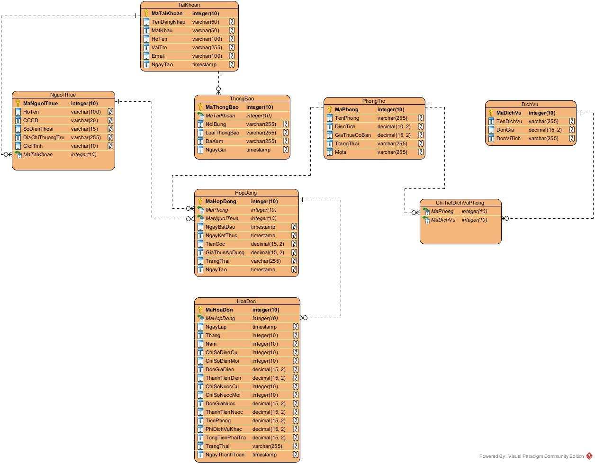
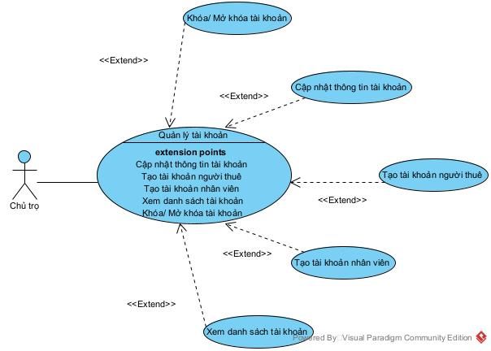

# PHÂN TÍCH VÀ THIẾT KẾ HỆ THỐNG QUẢN LÝ PHÒNG TRỌ

# *BUỔI 1(09/01/2026)*

## CHỨC NĂNG: QUẢN LÝ PHÒNG VÀ NGƯỜI THUÊ

### 1. Mục tiêu

Chức năng Quản lý phòng & người thuê nhằm hỗ trợ Chủ trọ và Nhân viên quản lý trong việc theo dõi, cập nhật và quản lý đầy đủ thông tin nghiệp vụ liên quan đến phòng trọ và người thuê, bao gồm đặc điểm phòng, tình trạng sử dụng, lịch sử thuê và tình trạng hợp đồng .

Bên cạnh đó, chức năng này cũng hỗ trợ Người thuê phòng trong việc  tra cứu thông tin liên quan đến phòng đang thuê, hợp đồng thuê và tình trạng thanh toán .

Trong đó, Chủ trọ có quyền giám sát toàn bộ hệ thống phòng trọ, bao gồm cả những phòng và dãy trọ do  Nhân viên quản lý phụ trách , nhằm đảm bảo việc quản lý được thống nhất và minh bạch.

### 2. Phạm vi chức năng

Chức năng Quản lý phòng & người thuê bao gồm:

* Quản lý thông tin chi tiết phòng trọ
* Quản lý thông tin người thuê và lịch sử thuê phòng
* Theo dõi tình trạng sử dụng phòng và số người ở
* Phân công nhân viên quản lý dãy trọ
* Cho phép  Chủ trọ xem toàn bộ phòng trọ , không phụ thuộc phạm vi quản lý của nhân viên
* Theo dõi tình trạng vi phạm hợp đồng thuê (nếu có)
* Cho phép Người thuê tra cứu thông tin cá nhân liên quan đến việc thuê phòng

### 3. Các đối tượng nghiệp vụ

#### 3.1. Chủ trọ

* Là người sở hữu một hoặc nhiều dãy trọ
* Có quyền xem, giám sát toàn bộ:
  * Dãy trọ
  * Phòng trọ
  * Người thuê
  * Lịch sử thuê phòng
* Có quyền phân công nhân viên quản lý dãy trọ

#### 3.2. Nhân viên quản lý

* Được phân công quản lý một hoặc nhiều dãy trọ
* Có quyền:
  * Cập nhật thông tin phòng
  * Cập nhật thông tin người thuê
  * Theo dõi tình trạng phòng và số người ở
* Chỉ thao tác trong phạm vi dãy trọ được phân công

#### 3.3. Người thuê

* Là đối tượng thuê phòng trọ
* Được cấp tài khoản để truy cập hệ thống
* Có quyền:
  * Xem thông tin phòng đang thuê
  * Xem thông tin hợp đồng thuê
  * Xem tình trạng thanh toán và hóa đơn (nếu có)
  * Nhận thông báo từ hệ thống
* Không có quyền thực hiện các thao tác quản lý dữ liệu

#### 3.4. Dãy trọ

* Thuộc quyền sở hữu của Chủ trọ
* Gồm nhiều phòng trọ
* Có thể được phân công cho một hoặc nhiều nhân viên quản lý

#### 3.5. Phòng trọ

* Thuộc về một dãy trọ
* Có các thông tin nghiệp vụ:
  * Loại phòng
  * Diện tích
  * Giá thuê
  * Số người ở tối đa
  * Trạng thái phòng

**Trạng thái phòng:**

* Trống
* Đang thuê

### 4. Nội dung quản lý

#### 4.1. Quản lý thông tin phòng

**Thông tin phòng bao gồm:**

* Mã phòng
* Loại phòng
* Diện tích
* Giá thuê
* Số người ở tối đa
* Trạng thái phòng *(Trống / Đang thuê)*
* Nhân viên quản lý phụ trách

**Nghiệp vụ quản lý phòng:**

* Thêm mới phòng
* Cập nhật thông tin phòng
* Theo dõi trạng thái sử dụng phòng
* Theo dõi số người đang ở trong phòng
* Gán phòng vào dãy trọ
* Phân công nhân viên quản lý dãy trọ

#### 4.2. Quản lý thông tin người thuê

**Thông tin người thuê bao gồm:**

* Họ tên
* Căn cước công dân (CCCD)
* Số điện thoại
* Phòng đang thuê
* Trạng thái thuê *(đang thuê / đã trả phòng)*

**Nghiệp vụ quản lý người thuê:**

* Thêm mới người thuê
* Cập nhật thông tin người thuê
* Gán người thuê vào phòng thông qua hợp đồng
* Theo dõi lịch sử thuê phòng của người thuê

#### 4.3. Theo dõi lịch sử thuê và vi phạm hợp đồng

* Lưu lại lịch sử các lần thuê phòng của người thuê
* Theo dõi tình trạng:
  * Vi phạm hợp đồng (nếu có)
  * Quá hạn hợp đồng
* Hỗ trợ Chủ trọ và Nhân viên quản lý trong việc kiểm soát rủi ro

### 5. Quan hệ nghiệp vụ

* Một Chủ trọ sở hữu nhiều Dãy trọ
* Một Dãy trọ gồm nhiều Phòng trọ
* Một Dãy trọ có thể được quản lý bởi một hoặc nhiều Nhân viên
* Một Phòng trọ có thể có nhiều Người thuê
* Một Người thuê có thể có lịch sử thuê nhiều phòng
* Chủ trọ có quyền xem tất cả phòng , kể cả phòng do nhân viên quản lý
* Người thuê chỉ được xem thông tin liên quan đến phòng và hợp đồng của chính mình

### 6. Quy trình nghiệp vụ trọng tâm

**Chủ trọ xem phòng do Nhân viên quản lý phụ trách**

1. Chủ trọ chọn chức năng Quản lý phòng & người thuê
2. Hệ thống hiển thị danh sách các dãy trọ
3. Chủ trọ chọn một dãy trọ
4. Hệ thống hiển thị:
   * Danh sách phòng
   * Loại phòng, diện tích, giá thuê
   * Trạng thái phòng
   * Số người đang ở
   * Nhân viên quản lý phụ trách
5. Chủ trọ chọn phòng để xem:
   * Danh sách người thuê
   * Lịch sử thuê phòng
   * Tình trạng hợp đồng (nếu có)

### 7. Quy tắc nghiệp vụ

* Phòng chỉ được cho thuê khi trạng thái là **Trống**
* Số người ở không được vượt quá số người tối đa của phòng
* Người thuê bắt buộc gắn với phòng thông qua hợp đồng
* Một phòng có thể có nhiều người thuê
* Nhân viên quản lý chỉ thao tác trên dãy trọ được phân công
* Chủ trọ luôn có quyền xem các phòng do nhân viên quản lý
* Người thuê có tài khoản nhưng chỉ được phép tra cứu thông tin, không được thao tác quản lý

## CHỨC NĂNG: QUẢN LÝ HỢP ĐỒNG VÀ HÓA ĐƠN

### 1. XÁC ĐỊNH TÁC NHÂN HỆ THỐNG (ACTORS)

Hệ thống quản lý hợp đồng và hóa đơn được thiết kế phục vụ ba nhóm tác nhân với vai trò, quyền hạn và mức độ can thiệp khác nhau nhằm đảm bảo tính  chặt chẽ về pháp lý , chính xác về tài chính và  an toàn dữ liệu .

#### a. Chủ trọ (Admin – Quản trị viên)

* Là người sở hữu và chịu trách nhiệm cao nhất đối với toàn bộ hệ thống.
* Có quyền giám sát, cấu hình và kiểm soát toàn bộ dữ liệu liên quan đến hợp đồng và hóa đơn.

Quyền hạn:

* Quản lý toàn bộ danh sách dãy trọ và phòng trọ
* Xem, theo dõi tất cả hợp đồng thuê trong hệ thống
* Xem báo cáo doanh thu tổng hợp từ hóa đơn
* Thiết lập và điều chỉnh các đơn giá chung (điện, nước, dịch vụ)
* Kiểm soát và xử lý các trường hợp đặc biệt (gia hạn, thanh lý, phạt cọc)

#### b. Quản lý dãy trọ (Staff – Nhân viên)

* Là người trực tiếp vận hành hệ thống tại từng khu vực/dãy trọ.
* Thực hiện các nghiệp vụ phát sinh hàng ngày liên quan đến hợp đồng và hóa đơn.

**Quyền hạn:**

* Lập hợp đồng thuê phòng cho người thuê mới
* Gia hạn hoặc thanh lý hợp đồng theo thực tế
* Ghi nhận chỉ số điện, nước định kỳ
* Lập hóa đơn và cập nhật trạng thái thu tiền

**Hạn chế:**

* Không được xóa dữ liệu lịch sử (hợp đồng đã kết thúc, hóa đơn đã phát hành)
* Không được xem báo cáo doanh thu của các dãy trọ khác
* Không được thay đổi các đơn giá chung do Chủ trọ thiết lập

#### c. Người thuê (Customer – Khách hàng)

* Là người thuê phòng trọ và sử dụng các dịch vụ đi kèm.
* Có tài khoản đăng nhập để theo dõi thông tin liên quan đến việc thuê phòng.

**Quyền hạn:**

* Xem thông tin cá nhân
* Xem thông tin phòng đang thuê
* Xem hợp đồng thuê và thời hạn hợp đồng
* Xem hóa đơn và trạng thái thanh toán
* Nhận thông báo từ Chủ trọ

**Hạn chế:**

* Không được chỉnh sửa bất kỳ dữ liệu nào trong hệ thống
* Không được thực hiện nghiệp vụ quản lý
* Chỉ được xem dữ liệu liên quan trực tiếp đến bản thân

### 2. PHÂN TÍCH NGHIỆP VỤ QUẢN LÝ HỢP ĐỒNG

Chức năng Quản lý Hợp đồng đóng vai trò  xương sống của hệ thống , là cơ sở pháp lý để xác định quyền và nghĩa vụ của người thuê, đồng thời là căn cứ để tính toán các khoản chi phí phát sinh.

#### a. Quy trình vòng đời hợp đồng (Contract Lifecycle)

Một hợp đồng thuê phòng trong hệ thống sẽ trải qua 4 giai đoạn trạng thái như sau:

**Giai đoạn 1: Khởi tạo hợp đồng (Creation)**

* Nhân viên lựa chọn phòng có trạng thái Trống
* Nhập đầy đủ thông tin:
  * Người thuê
  * Giá thuê phòng
  * Ngày bắt đầu thuê
  * Thời hạn hợp đồng
  * Tiền cọc
* Hệ thống kiểm tra ràng buộc nghiệp vụ:
  * Phòng phải đang ở trạng thái Trống
  * Người thuê chưa có hợp đồng hiệu lực khác
* Kết quả:
  * Trạng thái hợp đồng: Đang hiệu lực
  * Trạng thái phòng: Đang thuê

**Giai đoạn 2: Duy trì hợp đồng (Active)**

* Trong suốt thời gian thuê, hợp đồng được sử dụng làm:
  * Căn cứ truy xuất giá phòng
  * Căn cứ xác định thời hạn thuê
* Ràng buộc quan trọng:
  * Giá thuê phòng được cố định theo hợp đồng đã ký
  * Không thay đổi theo biến động thị trường
  * Chỉ được điều chỉnh nếu có gia hạn hoặc phụ lục hợp đồng

**Giai đoạn 3: Gia hạn hợp đồng (Extension)**

* Khi hợp đồng sắp hết hạn, nếu người thuê tiếp tục ở:
  * Nhân viên thực hiện chức năng **Gia hạn hợp đồng**
* Hệ thống cho phép:
  * Cập nhật ngày kết thúc mới
  * Điều chỉnh lại giá thuê (nếu có thỏa thuận)
* Trạng thái hợp đồng vẫn là **Đang hiệu lực**

**Giai đoạn 4: Thanh lý hợp đồng (Termination)**

* Xảy ra khi:
  * Hợp đồng hết hạn
  * Người thuê trả phòng
* Hệ thống hỗ trợ:
  * Kiểm tra các khoản nợ tồn đọng
  * Xác định xử lý tiền cọc
* **Kết quả:**
  * Trạng thái hợp đồng: **Đã kết thúc**
  * Trạng thái phòng: **Trống**

#### b. Các quy tắc nghiệp vụ quan trọng

**Quy tắc tiền cọc**

* Tiền cọc được ghi nhận trong hợp đồng
* Không tính vào doanh thu hàng tháng
* Khi thanh lý:
  * Hoàn trả 100% nếu không vi phạm
  * Khấu trừ một phần hoặc toàn bộ nếu vi phạm

**Quy tắc chấm dứt trước hạn**

* Nếu người thuê trả phòng trước thời hạn:
  * Hệ thống cảnh báo vi phạm hợp đồng
  * Nhân viên xác nhận:
    * Phạt cọc
    * Hoặc hoàn cọc theo thỏa thuận thực tế

### 3. PHÂN TÍCH NGHIỆP VỤ QUẢN LÝ HÓA ĐƠN

Chức năng Quản lý Hóa đơn đảm bảo việc  tính toán chính xác , minh bạch chi phí và  theo dõi doanh thu .

#### a. Quy trình lập hóa đơn hàng tháng

**Bước 1: Chốt chỉ số**

* Vào ngày quy định, nhân viên nhập:
  * Chỉ số điện mới
  * Chỉ số nước mới
* Hệ thống kiểm tra:
  * Chỉ số mới ≥ chỉ số cũ

**Bước 2: Tính toán chi phí**

Hệ thống tự động tính toán theo công thức:

* Tiền điện = (Chỉ số mới − Chỉ số cũ) × Đơn giá điện
* Tiền nước = (Chỉ số mới − Chỉ số cũ) × Đơn giá nước
* Tiền phòng = Lấy từ hợp đồng đang hiệu lực
* Tổng tiền = Tiền phòng + Tiền điện + Tiền nước + Dịch vụ khác

**Bước 3: Phát hành hóa đơn**

* Hóa đơn được tạo với trạng thái Chưa thu
* Hóa đơn được lưu vào hệ thống để:
  * Nhân viên theo dõi
  * Người thuê tra cứu

#### b. Các ràng buộc dữ liệu

* Mỗi hợp đồng chỉ được phát sinh tối đa 01 hóa đơn tiền phòng trong một tháng
* Không cho phép lập hóa đơn khi:
  * Hợp đồng đã kết thúc
  * Chưa có chỉ số điện, nước
* Chỉ số điện, nước phải đảm bảo tính liên tục giữa các tháng

## CHỨC NĂNG: THỐNG KÊ & BÁO CÁO

### 1. Mục tiêu chức năng

Chức năng Thống kê & Báo cáo được xây dựng nhằm hỗ trợ chủ trọ và nhân viên quản lý theo dõi, tổng hợp và nắm bắt tình hình hoạt động của hệ thống phòng trọ thông qua các chỉ số tổng hợp cơ bản và nâng cao, phục vụ công tác quản lý, đánh giá hiệu quả và ra quyết định trong vận hành hàng ngày và chiến lược.

### 2. Đối tượng sử dụng

* **Chủ trọ** : Quản lý toàn bộ các tòa/dãy trọ trong hệ thống.
* **Nhân viên quản lý** : Quản lý các tòa/dãy trọ được phân công.

### 3. Nội dung thống kê

#### 3.1 Các chỉ số thống kê tổng hợp (Dashboard)

**Chỉ số tổng quan:**

* Tổng doanh thu theo tháng/năm
* Số lượng phòng đang cho thuê
* Số lượng phòng còn trống
* Tỷ lệ lấp đầy (Occupancy Rate)
* Doanh thu trên mỗi phòng (Revenue Per Room)
* Số hợp đồng sắp hết hạn (trong vòng 30 ngày)

**Thống kê theo vòng đời hợp đồng:**

* Số hợp đồng mới tạo trong kỳ (Tháng/Quý)
* Số hợp đồng đã gia hạn trong kỳ
* Số hợp đồng đã thanh lý/chấm dứt trong kỳ
* Số hợp đồng chấm dứt trước hạn & Lý do (tự ý bỏ, vi phạm...)
* Thời gian lưu trú trung bình (Average Length of Stay)

**Thống kê tài chính chi tiết:**

* Cơ cấu doanh thu: Tiền phòng, tiền điện, tiền nước, phí dịch vụ, phí phát sinh...
* Tổng số tiền đặt cọc hiện đang giữ
* Tổng giá trị các hóa đơn quá hạn thanh toán
* Biến động giá phòng theo thời gian (nếu có điều chỉnh)

#### 3.2 Danh sách theo dõi & Báo cáo

* **Danh sách hóa đơn chưa/trễ thanh toán** : Ghi rõ số ngày quá hạn.
* **Danh sách hợp đồng sắp hết hạn** : Để chủ động liên hệ gia hạn.
* **Danh sách phòng sắp trống** : Dựa trên hợp đồng sắp thanh lý.
* **Báo cáo công nợ chi tiết** : Theo từng phòng/khách thuê.
* **Báo cáo sử dụng điện nước** : So sánh giữa các kỳ, phát hiện bất thường.

### 4. Phạm vi dữ liệu và phân quyền truy cập

* **Đối với Chủ trọ** :
  * Xem toàn bộ số liệu thống kê, báo cáo của tất cả các tòa/dãy trọ.
  * Theo dõi mọi danh sách và báo cáo chi tiết trên toàn hệ thống.
* **Đối với Nhân viên quản lý** :
  * Xem số liệu thống kê, báo cáo trong phạm vi các tòa/dãy trọ được phân công.
  * Theo dõi các danh sách thuộc phạm vi quản lý.

### 5. Quy trình nghiệp vụ

1. **Người dùng đăng nhập** vào hệ thống.
2. **Hệ thống xác định vai trò và phạm vi quản lý** của người dùng.
3. **Người dùng truy cập chức năng Thống kê & Báo cáo** .
4. **Hệ thống tổng hợp dữ liệu từ các phân hệ liên quan** :

* **Quản lý hợp đồng & Phòng** : Trạng thái phòng, vòng đời HĐ.
* **Quản lý thanh toán & Hóa đơn** : Doanh thu, công nợ.
* **Quản lý điện nước & dịch vụ** : Chỉ số công tơ, đơn giá, phí phát sinh.

1. **Dữ liệu được xử lý, tính toán** theo các quy tắc nghiệp vụ và hiển thị phù hợp với quyền truy cập.

### 6. Quy tắc nghiệp vụ & Ràng buộc

#### 6.1 Ràng buộc từ vòng đời Hợp đồng và Phòng

* **Dữ liệu thống kê phải phản ánh chính xác trạng thái hiện tại** của Hợp đồng (Mới, Đang hiệu lực, Đã thanh lý, Chấm dứt trước hạn) và Phòng (Đang thuê, Sắp trống, Đang trống, Đang sửa chữa).
* **Số phòng "đang thuê"** chỉ tính các phòng có Hợp đồng đang ở trạng thái "Đang hiệu lực".
* **Số phòng "sắp trống"** được tính dựa trên các Hợp đồng sắp hết hạn (vd: còn dưới 30 ngày) mà chưa có quyết định gia hạn.
* **Hợp đồng chấm dứt trước hạn** phải được ghi nhận lý do và ảnh hưởng đến thống kê doanh thu, tỷ lệ lấp đầy.

#### 6.2 Ràng buộc về tính toán tài chính

* **Cơ chế chốt chỉ số và tính tiền điện/nước:**
  1. **Định kỳ chốt công tơ** : Mỗi tháng, NVQL có nhiệm vụ nhập **chỉ số công tơ điện/nước cuối kỳ** cho từng phòng vào một mốc thời gian cố định (vd: ngày 25 hàng tháng).
  2. **Tự động tính toán** : Hệ thống tự tính **lượng tiêu thụ** = (Chỉ số cuối kỳ - Chỉ số đầu kỳ). **Chỉ số đầu kỳ** chính là **Chỉ số cuối kỳ** của tháng trước.
  3. **Áp dụng đơn giá** : Hệ thống áp dụng đơn giá điện/nước (theo bậc thang hoặc cố định) đã được cấu hình để tính thành tiền.
  4. **Tích hợp vào hóa đơn** : Số tiền này được tự động đưa vào hóa đơn tháng sau cùng với tiền phòng và các dịch vụ khác.
* **Đặt cọc** : Số tiền đặt cọc được thống kê riêng. Khi thanh lý HĐ, nếu có phát sinh phí phải đền bù, số tiền sẽ được trừ từ tiền cọc. Thống kê phải phản ánh số cọc "thực tế đang giữ".
* **Điều chỉnh giá phòng** : Mọi điều chỉnh giá phòng trong hợp đồng đều phải được ghi nhận lịch sử và thời điểm hiệu lực. Báo cáo doanh thu phải tính theo đúng giá áp dụng trong từng khoảng thời gian.
* **Chi phí dịch vụ** : Các loại phí dịch vụ (rác, internet, gửi xe...) phải được cấu hình rõ đơn giá và phương thức tính (theo phòng/ theo người/ cố định).

#### 6.3 Quy tắc chung

* Dữ liệu thống kê được tổng hợp theo các kỳ linh hoạt (Tháng, Quý, Năm, Tùy chọn khoảng ngày).
* Thông tin hiển thị đảm bảo tính chính xác, nhất quán và cập nhật theo thời gian thực khi có nghiệp vụ phát sinh.
* Mọi báo cáo đều có thể xuất ra file (PDF, Excel).

### 7. Luồng hoạt động

**Tác nhân:** Chủ trọ, Nhân viên quản lý

**Mô tả:** Người dùng truy cập hệ thống để xem các số liệu thống kê tổng quan và báo cáo chi tiết phục vụ công tác quản lý.

**Luồng chính:**

1. Người dùng đăng nhập hệ thống thành công.
2. Hệ thống xác định vai trò (Chủ trọ/NVQL) và phạm vi dữ liệu được phép truy cập.
3. Người dùng điều hướng đến chức năng  **Thống kê & Báo cáo** .
4. Hệ thống hiển thị **Dashboard tổng quan** với các chỉ số chính được tính toán theo thời gian thực.
5. Người dùng có thể:
   * **Lọc/Xem** dữ liệu theo Tòa nhà, Khoảng thời gian (tháng/năm/tùy chỉnh).
   * **Chuyển tab** để xem các báo cáo chi tiết: Báo cáo doanh thu, Báo cáo hợp đồng, Báo cáo công nợ, Báo cáo điện nước.
   * **Xuất file** báo cáo ra định dạng mong muốn.

**Kết quả:** Người dùng nắm bắt được toàn diện tình hình hoạt động, tài chính và hiệu quả quản lý của hệ thống/khu vực được phân công.

**Luồng ngoại lệ:**

* **Không có dữ liệu** trong khoảng thời gian/ phạm vi lọc → Hiển thị giao diện thông báo "Không có dữ liệu" thay vì biểu đồ/số liệu trống.
* **Dữ liệu chưa đầy đủ** (Vd: chưa chốt chỉ số điện nước cho kỳ này) → Hệ thống cảnh báo trên Dashboard/Báo cáo liên quan: "Dữ liệu [tên chỉ số] có thể chưa đầy đủ do chưa chốt chỉ số".
* **Lỗi trong quá trình tính toán** (Vd: thiếu đơn giá điện) → Hiển thị thông báo lỗi cụ thể cho quản trị viên và ghi nhận log.

## CHỨC NĂNG: QUẢN LÝ TÀI KHOẢN & THÔNG BÁO HỆ THỐNG

### 1. Mục tiêu chức năng

Chức năng **Quản lý tài khoản & thông báo hệ thống** nhằm:

* Quản lý các **tài khoản đăng nhập** vào hệ thống quản lý phòng trọ
* Phân quyền sử dụng hệ thống theo **vai trò**
* Cung cấp các **thông báo nội bộ** để người dùng nắm bắt kịp thời các sự kiện quan trọng liên quan đến hóa đơn

### 2. Phạm vi chức năng

#### 2.1. Đối tượng quản lý tài khoản

Hệ thống chỉ quản lý **tài khoản đăng nhập** , bao gồm:

| Loại tài khoản                      |  | Mô tả                                                                                   |
| -------------------------------------- | - | ----------------------------------------------------------------------------------------- |
| **Chủ trọ**                    |  | Người quản lý toàn bộ hệ thống phòng trọ                                        |
| **Nhân viên**                  |  | Người được chủ trọ tạo tài khoản để hỗ trợ quản lý                        |
| **Khách hàng (Người thuê)** |  | Người thuê phòng, có tài khoản để xem thông tin cá nhân và nhận thông báo |

* *Lưu ý:*

  * Tài khoản **Khách hàng** chỉ phục vụ mục đích xem thông tin, không tham gia quản lý dữ liệu hệ thống.
  * Mỗi người dùng chỉ có một tài khoản và một vai trò duy nhất.

### 3. Quản lý tài khoản

#### 3.1. Các chức năng quản lý tài khoản

Hệ thống hỗ trợ các chức năng quản lý tài khoản sau:

* Đăng nhập hệ thống
* Xem danh sách tài khoản (chỉ Chủ trọ)
* Thêm mới tài khoản Nhân viên
* Tạo tài khoản Khách hàng (gắn với người thuê)
* Cập nhật thông tin tài khoản (tên đăng nhập, mật khẩu)
* Khóa / mở khóa tài khoản

*Giới hạn chức năng:*

* Chủ trọ không chỉnh sửa dữ liệu thuê từ tài khoản Khách hàng.
* Khách hàng không tự tạo tài khoản, tài khoản được tạo bởi Chủ trọ hoặc Nhân viên.

### 4. Phân quyền người dùng

#### 4.1. Phân loại vai trò

Mỗi tài khoản chỉ có một vai trò duy nhất.

| Vai trò                | Quyền hạn                                         |
| ----------------------- | --------------------------------------------------- |
| **Chủ trọ**     | Toàn quyền trên hệ thống                       |
| **Nhân viên**   | Xem và cập nhật dữ liệu theo quyền            |
| **Người thuê** | Chỉ xem thông tin cá nhân và nhận thông báo |

#### 4.2. Quyền chi tiết

**Chủ trọ**

* Đăng nhập hệ thống
* Quản lý toàn bộ dữ liệu (phòng, người thuê, hợp đồng, hóa đơn)
* Quản lý tài khoản Nhân viên và Khách hàng
* Xem và xử lý tất cả thông báo hệ thống

**Nhân viên**

* Đăng nhập hệ thống
* Xem dữ liệu phòng, người thuê, hợp đồng, hóa đơn
* Cập nhật dữ liệu theo quyền được phân công
* Xem thông báo hệ thống

**Khách hàng (Người thuê)**

* Đăng nhập hệ thống
* Xem thông tin cá nhân
* Xem thông tin phòng đang thuê
* Xem hợp đồng thuê
* Xem hóa đơn và trạng thái thanh toán
* Nhận thông báo từ Chủ trọ

### 5. Thông báo trong hệ thống

#### 5.1. Mục đích

Thông báo giúp người dùng:

* Nhận biết các sự kiện quan trọng liên quan đến **hóa đơn, hợp đồng và phòng thuê**
* Hỗ trợ giao tiếp một chiều từ Chủ trọ → Nhân viên / Khách hàng
* Theo dõi tình trạng thuê và thanh toán kịp thời

#### 5.2. Loại thông báo

Hệ thống chỉ hỗ trợ các loại thông báo nội bộ:

| Loại thông báo            | Mô tả                                                         |
| ---------------------------- | --------------------------------------------------------------- |
| Có hóa đơn mới          | Khi hệ thống tạo hóa đơn mới                             |
| Hóa đơn chưa thanh toán | Khi hóa đơn đến hạn nhưng chưa được thanh toán      |
| Hóa đơn đã thanh toán  | Khi hóa đơn được cập nhật trạng thái đã thanh toán |
| Hợp đồng sắp hết hạn   | Khi hợp đồng thuê sắp đến ngày kết thúc               |
| Thông báo từ Chủ trọ    | Thông báo chung: nội quy, bảo trì, nhắc nhở              |
| Cập nhật thông tin phòng | Khi có thay đổi liên quan đến phòng đang thuê          |

* *Đối tượng nhận thông báo:*
* **Chủ trọ** : nhận tất cả thông báo hệ thống
* **Nhân viên** : nhận thông báo liên quan đến nghiệp vụ
* **Người thuê**: chỉ nhận thông báo liên quan đến phòng và hợp đồng của mình

#### 5.3. Hình thức hiển thị

* Thông báo chỉ hiển thị trong hệ thống
* Hiển thị tại:
  * Biểu tượng chuông 🔔
  * Danh sách thông báo trong giao diện
* Không gửi email
* Không có cài đặt bật/tắt thông báo

### 6. Kết luận

Chức năng Quản lý tài khoản & thông báo hệ thống đóng vai trò hỗ trợ vận hành hệ thống quản lý phòng trọ, đảm bảo:

* Quản lý chặt chẽ quyền truy cập
* Đơn giản, dễ sử dụng
* Phù hợp với quy mô nhỏ và vừa của mô hình phòng trọ
* Hỗ trợ giao tiếp hiệu quả giữa Chủ trọ – Nhân viên – Khách hàng

# BUỔI 2 (12/01/2026)

## 1. Mô tả bài toán

Trong thực tế, việc quản lý nhà trọ thường được thực hiện thủ công thông qua sổ sách hoặc các file rời rạc như Excel, dẫn đến nhiều khó khăn trong việc theo dõi và cập nhật thông tin. Chủ trọ và nhân viên quản lý phải quản lý đồng thời nhiều loại dữ liệu như thông tin phòng trọ, người thuê, hợp đồng thuê, các khoản chi phí hàng tháng (tiền phòng, tiền điện, tiền nước, dịch vụ), cũng như tình trạng thanh toán và thống kê doanh thu. Việc quản lý thủ công này dễ gây sai sót, trùng lặp dữ liệu, mất nhiều thời gian tổng hợp và khó kiểm soát khi số lượng phòng trọ tăng lên.

Xuất phát từ nhu cầu thực tế đó, nhóm xây dựng website quản lý phòng trọ nhằm hỗ trợ chủ trọ, nhân viên quản lý và người thuê phòng trong việc quản lý, tra cứu và theo dõi thông tin một cách tập trung, chính xác và hiệu quả.

* **Quản lý phòng trọ**
  Hệ thống cho phép quản lý chi tiết thông tin của từng phòng trọ, bao gồm:

  * Mã phòng, tên/số phòng
  * Diện tích phòng
  * Giá thuê cơ bản
  * Trạng thái phòng (trống, đang thuê)
  * Các dịch vụ đi kèm (wifi, giữ xe, vệ sinh, …)
  * Chi phí dịch vụ (nếu có)

  Thông tin phòng được sử dụng làm cơ sở để lập hợp đồng thuê và tính toán hóa đơn hàng tháng.
* **Quản lý người thuê**
  Hệ thống lưu trữ thông tin người thuê phòng, bao gồm:

  * Họ tên
  * Số điện thoại
  * Căn cước công dân (CCCD)
  * Ngày bắt đầu thuê
  * Phòng đang thuê

  Người thuê có thể được gán vào phòng thông qua hợp đồng thuê, đảm bảo việc quản lý mối quan hệ giữa phòng và người thuê được chặt chẽ.
* **Quản lý hợp đồng thuê**
  Hệ thống cho phép lập và quản lý hợp đồng thuê phòng với các thông tin:

  * Phòng thuê
  * Người thuê
  * Ngày bắt đầu và ngày kết thúc hợp đồng
  * Tiền cọc
  * Giá thuê áp dụng
  * Trạng thái hợp đồng (còn hiệu lực, hết hạn, đã kết thúc)

  Hợp đồng là cơ sở để phát sinh hóa đơn và theo dõi tình trạng thuê phòng.
* **Quản lý hóa đơn và chi phí**
  Hệ thống hỗ trợ lập và quản lý hóa đơn hàng tháng cho từng hợp đồng, bao gồm:

  * Tiền thuê phòng
  * Tiền điện (chỉ số điện, đơn giá điện)
  * Tiền nước (chỉ số nước, đơn giá nước)
  * Chi phí dịch vụ khác (nếu có)
  * Tổng số tiền phải thanh toán
  * Trạng thái hóa đơn (đã thanh toán, chưa thanh toán)

  Việc tính toán hóa đơn được thực hiện dựa trên dữ liệu hợp đồng và các chi phí liên quan.
* **Thống kê và báo cáo**
  Hệ thống cung cấp các chức năng thống kê và báo cáo nhằm hỗ trợ công tác quản lý, bao gồm:

  * Thống kê doanh thu theo tháng
  * Thống kê số lượng phòng đang thuê và phòng trống
  * Tổng hợp tình hình thanh toán hóa đơn

  Các thông tin thống kê được hiển thị dưới dạng bảng hoặc biểu đồ giúp chủ trọ dễ dàng theo dõi và ra quyết định.
* **Quản lý tài khoản và thông báo**
  Hệ thống cho phép quản lý tài khoản người dùng với các vai trò khác nhau:

  * Chủ trọ
  * Nhân viên quản lý
  * Người thuê

  Mỗi vai trò có quyền truy cập khác nhau vào các chức năng của hệ thống. Ngoài ra, hệ thống hỗ trợ gửi và hiển thị thông báo (ví dụ: thông báo hóa đơn, nhắc nhở thanh toán, thông báo hợp đồng sắp hết hạn) đến người thuê và nhân viên.

### 1.1. XÁC ĐỊNH ACTOR

Hệ thống có  **3 actor chính** , phân quyền rõ ràng theo nghiệp vụ thực tế.

| Actor                   | Mô tả                                                                                                                |
| ----------------------- | ---------------------------------------------------------------------------------------------------------------------- |
| **Chủ trọ**     | Người sở hữu và quản lý toàn bộ nhà trọ, có toàn quyền sử dụng hệ thống                              |
| **Nhân viên**   | Người hỗ trợ chủ trọ trong việc quản lý phòng, người thuê, hợp đồng, hóa đơn                        |
| **Người thuê** | Người thuê phòng, chỉ được xem các thông tin liên quan đến bản thân và nhận thông báo từ chủ trọ |

### 1.2. XÁC ĐỊNH USE CASE

**Nhóm xác thực**

* **Đăng nhập hệ thống**

**Nhóm quản lý phòng**

* **Quản lý phòng**
  (thêm, sửa, xóa, xem phòng; quản lý diện tích, giá thuê, dịch vụ, trạng thái phòng)

**Nhóm quản lý người thuê**

* **Quản lý người thuê**
  (thêm, sửa, xóa thông tin người thuê)
* **Gán người thuê vào phòng**

**Nhóm quản lý hợp đồng**

* **Quản lý hợp đồng thuê**
  (lập hợp đồng, cập nhật trạng thái, kết thúc hợp đồng)

 **Nhóm quản lý hóa đơn**

* **Quản lý hóa đơn**
  (lập hóa đơn, nhập chỉ số điện nước, tính chi phí dịch vụ, cập nhật trạng thái thanh toán)

**Nhóm thống kê & báo cáo**

* **Xem thống kê & báo cáo**
  (doanh thu, phòng trống, tình trạng thanh toán)

**Nhóm quản lý hệ thống**

* **Quản lý tài khoản**
* **Gửi thông báo**

**Nhóm chức năng dành cho Người thuê**

* **Xem thông tin thuê phòng**
* **Xem hóa đơn**
* **Nhận thông báo**

### 1.3. Use case Tổng quát

  

## 2. Xác định biểu đồ class

### 2.1. Xác định các lớp nghiệp vụ chính

Từ mô tả bài toán, hệ thống cần các  **nhóm lớp sau** :

**Nhóm người dùng & phân quyền**

* TaiKhoan
* VaiTro

**Nhóm quản lý phòng trọ**

* Phong
* DichVu
* ChiPhiDichVu

**Nhóm người thuê & hợp đồng**

* NguoiThue
* HopDong

**Nhóm hóa đơn & chi phí**

* HoaDon
* ChiTietHoaDon

**Nhóm thống kê & thông báo**

* BaoCao
* ThongBao

### 2.2. Mô tả các lớp

#### a. TaiKhoan

**Thuộc tính**

* maTaiKhoan
* tenDangNhap
* matKhau
* trangThai

**Phương thức**

* dangNhap()
* dangXuat()

#### b. VaiTro

**Thuộc tính**

* maVaiTro
* tenVaiTro *(Chủ trọ / Nhân viên / Người thuê)*

#### c. Phong

**Thuộc tính**

* maPhong
* tenPhong
* dienTich
* giaThue
* trangThai *(Trống / Đang thuê)*

**Phương thức**

* capNhatThongTin()
* capNhatTrangThai()

#### d. DichVu

**Thuộc tính**

* maDichVu
* tenDichVu
* donGia

#### e. ChiPhiDichVu

**Thuộc tính**

* soLuong
* thanhTien

#### f. NguoiThue

**Thuộc tính**

* maNguoiThue
* hoTen
* soDienThoai
* cccd

#### g. HopDong

**Thuộc tính**

* maHopDong
* ngayBatDau
* ngayKetThuc
* tienCoc
* giaThueApDung
* trangThai *(Còn hiệu lực / Hết hạn / Đã kết thúc)*

**Phương thức**

* kiemTraHieuLuc()

#### h. HoaDon

**Thuộc tính**

* maHoaDon
* thang
* tongTien
* trangThaiThanhToan

**Phương thức**

* tinhTongTien()

#### i. ChiTietHoaDon

**Thuộc tính**

* loaiChiPhi *(điện / nước / dịch vụ)*
* chiSoCu
* chiSoMoi
* donGia
* thanhTien

#### k. BaoCao

**Thuộc tính**

* thang
* tongDoanhThu
* soPhongDangThue
* soPhongTrong

**Phương thức**

* thongKeDoanhThu()
* thongKePhong()

#### l. ThongBao

**Thuộc tính**

* maThongBao
* noiDung
* ngayGui

**Phương thức**

* guiThongBao()

### 2.3. Biểu đồ class

  

## 3. THIẾT KẾ CƠ SỞ DỮ LIỆU (DATABASE DESIGN)

Dựa trên phân tích nghiệp vụ, cơ sở dữ liệu được thiết kế gồm các bảng (Table) chính sau đây:

### 3.1. Thiết kế các bảng

#### a. Bảng USERS (Người dùng)

Lưu trữ thông tin đăng nhập và phân quyền.

* **UserID** (Khoa chinh): Mã định danh người dùng.
* **Username** : Tên tài khoản.
* **Password** : Mật khẩu đã mã hóa.
* **Role** : Vai trò (ADMIN hoặc STAFF).
* **IsActive** : Trạng thái hoạt động.

#### b. Bảng ROOMS (Phòng trọ)

Lưu trữ thông tin vật lý của phòng.

* **RoomID** (Khoa chinh): Mã phòng.
* **RoomName** : Số phòng/Tên phòng.
* **BasePrice** : Giá niêm yết hiện tại.
* **Status** : Trạng thái (TRONG, DANG_THUE, BAO_TRI).
* **CurrentElectric** : Chỉ số điện chốt gần nhất.
* **CurrentWater** : Chỉ số nước chốt gần nhất.

#### c. Bảng TENANTS (Người thuê)

Lưu trữ hồ sơ khách hàng.

* **TenantID** (Khoa chinh): Mã khách thuê.
* **FullName** : Họ và tên.
* **CitizenID** : Số Căn cước công dân (Duy nhất).
* **Phone** : Số điện thoại liên lạc.
* **Address** : Địa chỉ thường trú.

#### d. Bảng CONTRACTS (Hợp đồng)

Bảng trung tâm liên kết Người thuê và Phòng, lưu trữ các điều khoản pháp lý.

* **ContractID** (Khoa chinh): Mã hợp đồng.
* **RoomID** (Khoa ngoai): Liên kết đến bảng ROOMS.
* **TenantID** (Khoa ngoai): Liên kết đến bảng TENANTS.
* **StartDate** : Ngày bắt đầu hợp đồng.
* **EndDate** : Ngày kết thúc hợp đồng.
* **RentPrice** : Giá thuê chốt trong hợp đồng (quan trọng để bảo lưu giá cũ).
* **DepositAmount** : Số tiền đặt cọc.
* **Status** : Trạng thái (DANG_HIEU_LUC, DA_KET_THUC, DA_HUY).

#### e. Bảng INVOICES (Hóa đơn)

Lưu trữ công nợ và lịch sử thanh toán.

* **InvoiceID** (Khoa chinh): Mã hóa đơn.
* **ContractID** (Khoa ngoai): Liên kết đến bảng CONTRACTS.
* **BillingMonth** : Tháng thanh toán (Ví dụ: 01/2026).
* **ElectricNew** : Chỉ số điện mới.
* **ElectricOld** : Chỉ số điện cũ.
* **WaterNew** : Chỉ số nước mới.
* **WaterOld** : Chỉ số nước cũ.
* **TotalAmount** : Tổng số tiền thanh toán.
* **PaymentStatus** : Trạng thái (CHUA_THU, DA_THU).
* **PaymentDate** : Ngày thực thu.

#### f. Mô tả mối quan hệ (Relationships)

* **ROOMS - CONTRACTS (1-n):** Một phòng có nhiều hợp đồng (lịch sử), nhưng chỉ có 1 hợp đồng Active tại một thời điểm.
* **TENANTS - CONTRACTS (1-n):** Một người có thể ký nhiều hợp đồng khác nhau.
* **CONTRACTS - INVOICES (1-n):** Một hợp đồng sinh ra nhiều hóa đơn hàng tháng.

### 3.2. Chi tiết cơ sở dữ liệu

#### 3.2.1. Xác định các thực thể (Entity)

Hệ thống bao gồm 7 thực thể chính và 1 thực thể trung gian:

1. **TaiKhoan (Tài Khoản):**
   * **Vai trò:** Quản lý thông tin đăng nhập và phân quyền hệ thống.
   * **Dữ liệu chính:** Tên đăng nhập, mật khẩu, họ tên, vai trò (Chủ trọ, Nhân viên, Người thuê).
2. **PhongTro (Phòng Trọ):**
   * **Vai trò:** Thực thể trung tâm, lưu trữ thông tin về sản phẩm kinh doanh.
   * **Dữ liệu chính:** Tên phòng, giá thuê cơ bản, diện tích, trạng thái hiện tại.
3. **DichVu (Dịch Vụ):**
   * **Vai trò:** Danh mục các dịch vụ cộng thêm (ngoài tiền phòng).
   * **Dữ liệu chính:** Tên dịch vụ (Wifi, Rác...), đơn giá, đơn vị tính.
4. **NguoiThue (Người Thuê):**
   * **Vai trò:** Khách hàng sử dụng dịch vụ.
   * **Dữ liệu chính:** Họ tên, CCCD, quê quán, số điện thoại.
5. **HopDong (Hợp Đồng):**
   * **Vai trò:** Văn bản pháp lý liên kết giữa Phòng trọ và Người thuê.
   * **Dữ liệu chính:** Ngày bắt đầu, ngày kết thúc, tiền cọc, giá thuê chốt tại thời điểm ký.
6. **HoaDon (Hóa Đơn):**
   * **Vai trò:** Chứng từ thanh toán hàng tháng được sinh ra từ Hợp đồng.
   * **Dữ liệu chính:** Chỉ số điện/nước cũ mới, thành tiền từng hạng mục, tổng tiền, trạng thái thanh toán.
7. **ThongBao (Thông Báo):**
   * **Vai trò:** Kênh giao tiếp từ hệ thống đến người dùng.
   * **Dữ liệu chính:** Nội dung thông báo, trạng thái đã xem.
8. **ChiTietDichVu (Chi Tiết Dịch Vụ - Bảng trung gian):**
   * **Vai trò:** Cấu hình dịch vụ cụ thể cho từng phòng (Vì mỗi phòng có thể dùng các dịch vụ khác nhau).

### 3.2.2. Xác định các mối quan hệ giữa các bảng (Relationships)

Dưới đây là phân tích chi tiết các liên kết khóa ngoại (Foreign Key) và bản số (Cardinality):

#### a. Quan hệ: TaiKhoan - NguoiThue

* **Loại quan hệ:** 1 - 1 (Một - Một) hoặc 1 - 0..1 (Một - Không hoặc Một)
* **Liên kết:** `TaiKhoan.MaTaiKhoan` ↔ `NguoiThue.MaTaiKhoan`
* **Ý nghĩa nghiệp vụ:**
  * Một người thuê *có thể* được cấp 1 tài khoản để đăng nhập vào hệ thống xem hóa đơn.
  * Tuy nhiên, không bắt buộc người thuê nào cũng phải có tài khoản (Quản lý có thể nhập tay thông tin người thuê mà không cần tạo nick).

#### b. Quan hệ: PhongTro - DichVu (Thông qua bảng trung gian ChiTietDichVu)

* **Loại quan hệ:** N - N (Nhiều - Nhiều)
* **Liên kết:**
  * `PhongTro.MaPhong` ↔ `ChiTietDichVu.MaPhong` (1 - N)
  * `DichVu.MaDichVu` ↔ `ChiTietDichVu.MaDichVu` (1 - N)
* **Ý nghĩa nghiệp vụ:**
  * Một phòng trọ có thể sử dụng nhiều dịch vụ (Ví dụ: Phòng 101 dùng Wifi và Rác).
  * Một dịch vụ có thể áp dụng cho nhiều phòng (Ví dụ: Dịch vụ Wifi áp dụng cho cả dãy trọ).

#### c. Quan hệ: PhongTro - HopDong

* **Loại quan hệ:** 1 - N (Một - Nhiều)
* **Liên kết:** `PhongTro.MaPhong` ↔ `HopDong.MaPhong`
* **Ý nghĩa nghiệp vụ:**
  * Một phòng trọ theo thời gian sẽ có nhiều hợp đồng (Lịch sử thuê: Năm 2023 ông A thuê, năm 2024 ông B thuê).
  * Tại một thời điểm cụ thể, một phòng chỉ có 1 hợp đồng đang ở trạng thái `HieuLuc`.

#### d. Quan hệ: NguoiThue - HopDong

* **Loại quan hệ:** 1 - N (Một - Nhiều)
* **Liên kết:** `NguoiThue.MaNguoiThue` ↔ `HopDong.MaNguoiThue`
* **Ý nghĩa nghiệp vụ:**
  * Một khách hàng có thể ký nhiều hợp đồng (Ví dụ: Thuê phòng A, sau đó chuyển sang phòng B ký hợp đồng mới, hoặc gia hạn hợp đồng cũ).
  * Một hợp đồng chỉ thuộc về một người đại diện đứng tên thuê.

#### e. Quan hệ: HopDong - HoaDon

* **Loại quan hệ:** 1 - N (Một - Nhiều)
* **Liên kết:** `HopDong.MaHopDong` ↔ `HoaDon.MaHopDong`
* **Ý nghĩa nghiệp vụ:**
  * Một hợp đồng thuê dài hạn (ví dụ 12 tháng) sẽ sinh ra 12 hóa đơn thanh toán tiền nhà hàng tháng.
  * Hóa đơn bắt buộc phải gắn với hợp đồng để biết được giá phòng và giá dịch vụ đã thỏa thuận là bao nhiêu.

#### f. Quan hệ: TaiKhoan - ThongBao

* **Loại quan hệ:** 1 - N (Một - Nhiều)
* **Liên kết:** `TaiKhoan.MaTaiKhoan` ↔ `ThongBao.MaTaiKhoan`
* **Ý nghĩa nghiệp vụ:**
  * Một tài khoản người dùng (Chủ trọ, nhân viên, khách thuê) có thể nhận được nhiều thông báo từ hệ thống.

### 3.2.3. Tóm tắt sơ đồ liên kết

 **TaiKhoan** (1) ---- (0..1) **NguoiThue** (1) ---- (N) **HopDong** (1) ---- (N) **HoaDon**

 **PhongTro** (1) ---- (N) **HopDong**

 **PhongTro** (1) ---- (N) **ChiTietDichVu** (N) ---- (1) **DichVu**

### 3.2.4. Biểu đồ Quan hệ thực thể (ERD)

  

## 4. PHÂN TÍCH CÁC GIAO DIỆN CẦN THIẾT

### 4.1. Giao diện đăng nhập

* Mục đích: Đăng nhập vào hệ thống với 3 loại tài khoản: Chủ trọ, Nhân viên quản lý, Người thuê.
* Thành phần chính:
  * Form đăng nhập với username/email và password
  * Lựa chọn loại tài khoản (Chủ trọ/Nhân viên/Người thuê)
  * Nút "Đăng nhập" và link "Quên mật khẩu?"
  * Hiển thị thông báo lỗi nếu đăng nhập sai

### 4.2. Giao diện Dashboard

#### 4.2.1. Dashboard Chủ trọ

* **Thống kê nhanh**
  * Tổng số phòng
  * Số phòng đang thuê
  * Số phòng trống
* **Doanh thu**
  * Doanh thu tháng hiện tại
* **Danh sách nhắc việc**
  * Danh sách hợp đồng sắp hết hạn
  * Danh sách hóa đơn chưa thanh toán
* **Biểu đồ**
  * Biểu đồ doanh thu 6 tháng gần nhất

#### 4.2.2. Dashboard Nhân viên quản lý

* Hiển thị thông tin tương tự Dashboard Chủ trọ
* Giới hạn dữ liệu:
  * Chỉ hiển thị các phòng được phân công quản lý
* Bổ sung chức năng:
  * Báo cáo công việc hàng ngày
  * Theo dõi tình trạng xử lý công việc

#### 4.2.3. Dashboard Người thuê

* **Thông tin cá nhân**
  * Thông tin người thuê
  * Thông tin phòng đang thuê
* **Hóa đơn**
  * Hóa đơn hiện tại
  * Lịch sử thanh toán
* **Thông báo**
  * Thông báo từ chủ trọ
  * Thông báo từ nhân viên quản lý

### 4.3. Giao diện quản lý phòng trọ

* **Mục đích**
  * Quản lý danh sách và thông tin các phòng trọ
* **Thành phần chính**
  * Danh sách phòng dạng bảng, bao gồm các cột:
    * Mã phòng
    * Tên phòng
    * Diện tích
    * Giá thuê
    * Trạng thái
  * Chức năng tìm kiếm và lọc:
    * Lọc theo trạng thái phòng
    * Lọc theo khoảng giá thuê
  * Chức năng thao tác:
    * Thêm phòng mới
    * Sửa thông tin phòng
    * Xóa phòng
  * Form thêm/sửa phòng:
    * Mã phòng
    * Diện tích
    * Giá thuê
    * Dịch vụ đi kèm
  * **Trạng thái phòng**
    * Trống (có thể cho thuê)
    * Đang thuê
    * Đang sửa chữa

### 4.4. Giao diện quản lý người thuê

* **Mục đích**
  * Lưu trữ và quản lý thông tin người thuê phòng
* **Thành phần chính**
  * Danh sách người thuê với các cột:
    * Họ tên
    * Số điện thoại
    * CCCD
    * Phòng đang thuê
  * Chức năng tìm kiếm:
    * Theo họ tên
    * Theo số điện thoại
    * Theo CCCD
  * Chức năng thao tác:
    * Thêm người thuê mới
    * Sửa thông tin người thuê
    * Xóa người thuê
  * Form thêm/sửa người thuê:
    * Họ tên
    * Số điện thoại
    * CCCD
    * Ngày sinh
    * Quê quán
    * Nghề nghiệp
  * Hồ sơ chi tiết người thuê:
    * Thông tin cá nhân
    * Hợp đồng hiện tại
    * Lịch sử thanh toán

### 4.5. Giao diện quản lý hợp đồng

* **Mục đích**
  * Quản lý vòng đời hợp đồng thuê phòng
* **Thành phần chính**
  * Danh sách hợp đồng với các cột:
    * Số hợp đồng
    * Người thuê
    * Phòng
    * Ngày bắt đầu
    * Ngày kết thúc
    * Trạng thái
  * Lọc hợp đồng theo trạng thái:
    * Đang hiệu lực
    * Sắp hết hạn
    * Đã kết thúc
  * Chức năng thao tác:
    * Tạo hợp đồng mới
    * Gia hạn hợp đồng
    * Kết thúc hợp đồng
* **Form tạo hợp đồng**
  * Bước 1: Chọn phòng trống
  * Bước 2: Chọn người thuê
    * Chọn từ danh sách có sẵn
    * Hoặc tạo mới người thuê
  * Bước 3: Nhập thông tin hợp đồng
    * Ngày bắt đầu
    * Ngày kết thúc
    * Tiền cọc
    * Giá thuê
    * Đơn giá điện/nước
  * Bước 4: Xác nhận và in hợp đồng
* **Form gia hạn hợp đồng**
  * Chọn ngày kết thúc mới
  * Điều chỉnh giá thuê (nếu có)
* **Form kết thúc hợp đồng**
  * Nhập ngày kết thúc thực tế
  * Kiểm tra tình trạng phòng
  * Quyết toán tiền cọc

### 4.6. Giao diện quản lý hóa đơn

* **Mục đích**
  * Tạo và quản lý hóa đơn thanh toán hàng tháng
* **Thành phần chính**
  * Danh sách hóa đơn với các cột:
    * Số hóa đơn
    * Phòng
    * Người thuê
    * Tháng
    * Tổng tiền
    * Trạng thái
  * Lọc hóa đơn theo trạng thái:
    * Chưa thanh toán
    * Đã thanh toán
    * Quá hạn
  * Chức năng thao tác:
    * Tạo hóa đơn mới
    * Thanh toán hóa đơn
    * In hóa đơn
* **Form tạo hóa đơn**
  * Chọn hợp đồng
    * Tự động điền thông tin phòng và người thuê
  * Chọn kỳ thanh toán (tháng/năm)
  * Nhập chỉ số điện/nước:
    * Chỉ số đầu kỳ (tự động)
    * Chỉ số cuối kỳ
  * Hệ thống tự động tính:
    * Sản lượng sử dụng
    * Tiền điện/nước
  * Tự động tính:
    * Tiền phòng
    * Tiền dịch vụ
  * Tính tổng tiền và hạn thanh toán
* **Form thanh toán hóa đơn**
  * Ngày thanh toán
  * Phương thức thanh toán
  * In biên lai

### 4.7. Giao diện chốt chỉ số điện nước

* **Mục đích**
  * Hỗ trợ nhân viên chốt chỉ số điện nước hàng tháng
* **Thành phần chính**
  * Chọn tháng cần chốt chỉ số
  * Bảng danh sách phòng:
    * Mã phòng
    * Người thuê
    * Chỉ số điện đầu/cuối
    * Chỉ số nước đầu/cuối
  * Chỉ số đầu kỳ:
    * Tự động lấy từ kỳ trước
  * Nhập chỉ số cuối kỳ
  * Hệ thống:
    * Tự tính sản lượng
    * Cảnh báo khi sản lượng bất thường
  * Chức năng thao tác:
    * Lưu dữ liệu
    * Hoàn thành chốt số
    * In bảng chốt số

### 4.8. Giao diện thống kê báo cáo

* **Mục đích**
  * Thống kê và báo cáo tình hình hoạt động của nhà trọ
* **Thành phần chính**
  * Báo cáo doanh thu theo tháng
    * Biểu đồ
    * Bảng số liệu
  * Thống kê tỷ lệ:
    * Phòng đang thuê
    * Phòng trống
  * Báo cáo tình trạng thanh toán hóa đơn
  * Thống kê hợp đồng:
    * Số hợp đồng mới
    * Số hợp đồng gia hạn
    * Số hợp đồng kết thúc
  * Lọc dữ liệu theo:
    * Tháng
    * Quý
    * Năm
  * Xuất báo cáo:
    * Excel
    * PDF

### 4.9. Giao diện quản lý tài khoản

* **Mục đích**
  * Quản lý tài khoản người dùng trong hệ thống
* **Thành phần chính**
  * Đối với Chủ trọ:
    * Quản lý danh sách nhân viên
    * Thêm/Sửa/Xóa tài khoản nhân viên
    * Phân quyền theo tòa nhà
  * Đối với Nhân viên:
    * Xem thông tin cá nhân
    * Cập nhật thông tin cá nhân
    * Đổi mật khẩu
  * Đối với Người thuê:
    * Xem thông tin cá nhân
    * Cập nhật thông tin cá nhân
    * Đổi mật khẩu
  * Form thêm/sửa tài khoản:
    * Tên đăng nhập
    * Mật khẩu
    * Họ tên
    * Số điện thoại
    * Email
    * Vai trò

### 4.10. Giao diện quản lý thông báo

* **Mục đích**
  * Gửi và nhận thông báo trong hệ thống
* **Thành phần chính**
  * Gửi thông báo:
    * Chọn loại thông báo:
      * Nhắc thanh toán
      * Nhắc gia hạn hợp đồng
      * Thông báo chung
    * Chọn người nhận:
      * Tất cả người thuê
      * Người thuê cụ thể
      * Theo phòng
    * Nhập tiêu đề và nội dung
  * Hộp thông báo:
    * Danh sách thông báo đã nhận
    * Đánh dấu đã đọc
  * Lịch sử gửi danh sách thông báo đã gửi

### 4.11. Giao diện cài đặt hệ thống (Chỉ Chủ trọ)

* **Mục đích**
  * Cấu hình các thông số chung của hệ thống
* **Thành phần chính**
  * Cài đặt đơn giá mặc định: Điện, Nước, Dịch vụ
  * Cấu hình ngày chốt chỉ số điện nước hàng tháng
  * Cài đặt template thông báo
  * Cấu hình thông tin thông tin liên hệ của nhà trọ

# BUỔI 3 (16/01/2026)

## 1. Phân rã UC Đăng nhập

  

### 1.1. Đặc tả use case: Đăng nhập

| **Mục**                      | **Nội dung**                                                                                                                                                                                                                                                                                                                                                                                                                                                                                                           |
| ----------------------------------- | ----------------------------------------------------------------------------------------------------------------------------------------------------------------------------------------------------------------------------------------------------------------------------------------------------------------------------------------------------------------------------------------------------------------------------------------------------------------------------------------------------------------------------- |
| **Tên Use Case**             | Đăng nhập                                                                                                                                                                                                                                                                                                                                                                                                                                                                                                                  |
| **Mô tả**                   | Cho phép người dùng (Chủ trọ, Nhân viên, Người thuê) đăng nhập vào hệ thống bằng tài khoản hợp lệ. Hệ thống thực hiện kiểm tra thông tin đăng nhập, trạng thái tài khoản và phân quyền truy cập theo vai trò.                                                                                                                                                                                                                                                                         |
| **Actor chính**              | - Chủ trọ - Nhân viên - Người thuê                                                                                                                                                                                                                                                                                                                                                                                                                                                                           |
| **Actor phụ**                | Hệ thống                                                                                                                                                                                                                                                                                                                                                                                                                                                                                                                    |
| **Điều kiện tiên quyết** | - Người dùng đã được tạo tài khoản trong hệ thống - Tài khoản chưa bị khóa - Người dùng chưa đăng nhập tại thời điểm thực hiện - Hệ thống đang hoạt động bình thường                                                                                                                                                                                                                                                                                                   |
| **Luồng chính**             | 1. Người dùng truy cập trang đăng nhập. 2. Nhập tên đăng nhập và mật khẩu hợp lệ (mật khẩu gồm tối thiểu 8 ký tự bao gồm chữ hoa, chữ thường, số, ký tự đặc biệt). 3. Nhấn nút **Đăng nhập**. 4. Hệ thống kiểm tra thông tin đăng nhập. 5. Hệ thống kiểm tra trạng thái tài khoản. 6. Hệ thống xác định vai trò và phân quyền truy cập. 7. Hệ thống chuyển đến giao diện tương ứng với vai trò người dùng. |
| **Luồng phụ / Ngoại lệ**  | 2a. Thiếu tên đăng nhập hoặc mật khẩu → Thông báo yêu cầu nhập đầy đủ. 4a. Sai thông tin đăng nhập → Thông báo lỗi, kết thúc Use Case. 5a. Tài khoản bị khóa → Thông báo liên hệ Chủ trọ, kết thúc Use Case. 6a. Vai trò không hợp lệ → Từ chối đăng nhập và ghi nhận lỗi phân quyền.                                                                                                                                                                 |
| Ràng buộc nghiệp vụ             | - Mỗi tài khoản chỉ có một vai trò duy nhất.  - Chỉ tài khoản ở trạng thái **Hoạt động** mới được đăng nhập.   - Người dùng chỉ được truy cập chức năng đúng với quyền được phân.                                                                                                                                                                                                                                                                                   |
| **Kết quả**                 | Người dùng đăng nhập thành công, hệ thống tạo phiên làm việc và cấp quyền truy cập phù hợp với vai trò.                                                                                                                                                                                                                                                                                                                                                                                                 |

## 2. Phân rã UC Quản lý và nhận thông báo

  

### 2.1. Đặc tả use case: Quản lý và Nhận thông báo

| **Mục**                      | **Nội dung**                                                                                                                                                                                                                                                            |
| ----------------------------------- | ------------------------------------------------------------------------------------------------------------------------------------------------------------------------------------------------------------------------------------------------------------------------------ |
| **Tên Use Case**             | Quản lý và nhận thông báo                                                                                                                                                                                                                                                |
| **Mô tả**                   | Cho phép Chủ trọ tạo và gửi thông báo đến các đối tượng trong hệ thống. Nhân viên và Người thuê có thể xem danh sách thông báo và đánh dấu đã đọc.                                                                                         |
| **Actor chính**              | Chủ trọ                                                                                                                                                                                                                                                                      |
| **Actor phụ**                | Nhân viên Người thuê Hệ thống                                                                                                                                                                                                                                 |
| **Điều kiện tiên quyết** | - Người dùng đã đăng nhập hệ thống - Tài khoản đang ở trạng thái hoạt động                                                                                                                                                                             |
| **Luồng chính**             | 1. Chủ trọ truy cập chức năng Quản lý và nhận thông báo. 2. Hệ thống hiển thị danh sách thông báo hiện có. 3. Chủ trọ chọn tạo thông báo mới hoặc xem danh sách thông báo. 4. Hệ thống xử lý theo chức năng được chọn. |
| **Luồng phụ / Mở rộng**   | *Use Case này được mở rộng bởi các UC con (extend).*                                                                                                                                                                                                                 |
| **Kết quả**                 | Thông báo được tạo, gửi và hiển thị đúng cho các đối tượng liên quan.                                                                                                                                                                                        |

### 2.2. Đặc tả use case: Tạo thông báo

| **Mục**                      | **Nội dung**                                                                                                                                                                   |
| ----------------------------------- | ------------------------------------------------------------------------------------------------------------------------------------------------------------------------------------- |
| **Tên Use Case**             | Tạo thông báo                                                                                                                                                                      |
| **Actor chính**              | Chủ trọ                                                                                                                                                                             |
| **Actor phụ**                | Hệ thống                                                                                                                                                                            |
| **Điều kiện tiên quyết** | Chủ trọ đã đăng nhập                                                                                                                                                           |
| **Luồng chính**             | 1. Chủ trọ chọn chức năng Tạo thông báo. 2. Nhập tiêu đề và nội dung thông báo. 3. Nhấn nút Lưu / Tạo thông báo. 4. Hệ thống lưu thông báo. |
| **Luồng phụ**               | 2a. Nội dung trống → Hệ thống yêu cầu nhập đầy đủ thông tin.                                                                                                             |
| **Kết quả**                 | Thông báo mới được tạo trong hệ thống.                                                                                                                                       |

### 2.3. Đặc tả use case: Gửi thông báo theo đối tượng

| **Mục**                      | **Nội dung**                                                                                                                                                                                                               |
| ----------------------------------- | --------------------------------------------------------------------------------------------------------------------------------------------------------------------------------------------------------------------------------- |
| **Tên Use Case**             | Gửi thông báo theo đối tượng                                                                                                                                                                                               |
| **Actor chính**              | Chủ trọ                                                                                                                                                                                                                         |
| **Actor phụ**                | Hệ thống                                                                                                                                                                                                                        |
| **Điều kiện tiên quyết** | Đã có thông báo được tạo                                                                                                                                                                                                 |
| **Luồng chính**             | 1. Chủ trọ chọn thông báo cần gửi. 2. Chọn đối tượng nhận (Nhân viên / Người thuê / Tất cả). 3. Xác nhận gửi thông báo. 4. Hệ thống phân phối thông báo đến đúng đối tượng. |
| **Luồng phụ**               | 2a. Không chọn đối tượng → Hệ thống yêu cầu chọn đối tượng nhận.                                                                                                                                                 |
| **Kết quả**                 | Thông báo được gửi và hiển thị cho người nhận.                                                                                                                                                                        |

### 2.4. Đặc tả use case: Xem danh sách thông báo

| **Mục**                      | **Nội dung**                                                                                                                                                                                                                                                                                                                         |
| ----------------------------------- | ------------------------------------------------------------------------------------------------------------------------------------------------------------------------------------------------------------------------------------------------------------------------------------------------------------------------------------------- |
| **Tên Use Case**             | Xem danh sách thông báo                                                                                                                                                                                                                                                                                                                  |
| **Actor chính**              | Chủ trọ Nhân viên Người thuê                                                                                                                                                                                                                                                                                               |
| **Actor phụ**                | Hệ thống                                                                                                                                                                                                                                                                                                                                  |
| **Điều kiện tiên quyết** | Người dùng đã đăng nhập hệ thống                                                                                                                                                                                                                                                                                                  |
| **Luồng chính**             | 1. Người dùng truy cập mục Thông báo. 2. Hệ thống tải danh sách thông báo tương ứng với vai trò người dùng. 3. Hệ thống hiển thị danh sách thông báo (mới / đã đọc). 4. Người dùng chọn một thông báo để xem chi tiết.                                                            |
| **Luồng phụ / Ngoại lệ**  | **2a.** Không có thông báo nào → Hệ thống hiển thị thông báo “Chưa có thông báo”. **2b.** Người dùng không có quyền xem thông báo đó → Hệ thống ẩn thông báo khỏi danh sách. **3a.** Lỗi tải dữ liệu → Hệ thống hiển thị thông báo lỗi và cho phép tải lại. |
| **Kết quả**                 | Người dùng xem được danh sách và nội dung các thông báo hợp lệ.                                                                                                                                                                                                                                                               |

### 2.5. Đặc tả use case: Đánh dấu đã đọc

| **Mục**                      | **Nội dung**                                                                                                                                                                                                                                                                                                                                                                                                                                                                                                                                                                                                                                                                                                                                 |
| ----------------------------------- | --------------------------------------------------------------------------------------------------------------------------------------------------------------------------------------------------------------------------------------------------------------------------------------------------------------------------------------------------------------------------------------------------------------------------------------------------------------------------------------------------------------------------------------------------------------------------------------------------------------------------------------------------------------------------------------------------------------------------------------------------- |
| **Tên Use Case**             | Đánh dấu đã đọc                                                                                                                                                                                                                                                                                                                                                                                                                                                                                                                                                                                                                                                                                                                              |
| **Actor chính**              | Nhân viên Người thuê                                                                                                                                                                                                                                                                                                                                                                                                                                                                                                                                                                                                                                                                                                                      |
| **Actor phụ**                | Hệ thống                                                                                                                                                                                                                                                                                                                                                                                                                                                                                                                                                                                                                                                                                                                                          |
| **Điều kiện tiên quyết** | - Người dùng đã đăng nhập hệ thống - Tồn tại ít nhất một thông báo chưa đọc                                                                                                                                                                                                                                                                                                                                                                                                                                                                                                                                                                                                                                                |
| **Luồng chính**             | **Cách 1 – Đánh dấu khi mở thông báo** 1. Người dùng mở một thông báo chưa đọc. 2. Hệ thống ghi nhận hành động xem thông báo. 3. Hệ thống cập nhật trạng thái thông báo sang “Đã đọc”. 4. Biểu tượng thông báo (chuông) được cập nhật số lượng chưa đọc.  **Cách 2 – Đánh dấu mà không cần đọc nội dung** 1’. Người dùng chọn một hoặc nhiều thông báo chưa đọc trong danh sách. 2’. Người dùng nhấn nút **“Đánh dấu đã đọc”**. 3’. Hệ thống cập nhật trạng thái các thông báo được chọn sang “Đã đọc”. 4’. Biểu tượng thông báo được cập nhật. |
| **Luồng phụ / Ngoại lệ**  | **1a.** Thông báo đã ở trạng thái “Đã đọc” → Hệ thống không thay đổi trạng thái. **2’a.** Người dùng không chọn thông báo nào → Hệ thống hiển thị thông báo yêu cầu chọn thông báo. **3a.** Lỗi cập nhật trạng thái → Hệ thống giữ nguyên trạng thái cũ và ghi log lỗi. **3b.** Người dùng không còn quyền truy cập thông báo → Hệ thống hủy thao tác.                                                                                                                                                                                                                                                                                |
| **Kết quả**                 | Trạng thái thông báo được cập nhật chính xác trong hệ thống.                                                                                                                                                                                                                                                                                                                                                                                                                                                                                                                                                                                                                                                                           |

## 3. Phân rã UC Quản lý tài khoản

### 3.1 Xem danh sách tài khoản

| Mục                                | Nội dung                                                                                                                                                                                   |
| ----------------------------------- | ------------------------------------------------------------------------------------------------------------------------------------------------------------------------------------------- |
| **Tên Use Case**             | Xem danh sách tài khoản                                                                                                                                                                  |
| **Mô tả**                   | Cho phép Chủ trọ xem toàn bộ các tài khoản trong hệ thống                                                                                                                         |
| **Actor chính**              | Chủ trọ                                                                                                                                                                                   |
| **Actor phụ**                | Hệ thống                                                                                                                                                                                  |
| **Điều kiện tiên quyết** | Chủ trọ đã đăng nhập                                                                                                                                                                 |
| **Luồng chính**             | 1. Chủ trọ chọn chức năng “Quản lý tài khoản”. 2. Chọn “Xem danh sách tài khoản”. 3. Hệ thống truy xuất dữ liệu. 4. Hiển thị danh sách tài khoản. |
| **Luồng phụ / Ngoại lệ**  | 3a. Không có tài khoản → Hiển thị danh sách rỗng.                                                                                                                                  |
| **Kết quả**                 | Danh sách tài khoản được hiển thị                                                                                                                                                   |

### 3.2 Tạo tài khoản nhân viên

| Mục                                | Nội dung                                                                                                                                                                              |
| ----------------------------------- | -------------------------------------------------------------------------------------------------------------------------------------------------------------------------------------- |
| **Tên Use Case**             | Tạo tài khoản Nhân viên                                                                                                                                                           |
| **Mô tả**                   | Cho phép Chủ trọ tạo tài khoản mới cho Nhân viên                                                                                                                              |
| **Actor chính**              | Chủ trọ                                                                                                                                                                              |
| **Actor phụ**                | Hệ thống                                                                                                                                                                             |
| **Điều kiện tiên quyết** | Chủ trọ đã đăng nhập                                                                                                                                                            |
| **Luồng chính**             | 1. Chọn “Tạo tài khoản”. 2. Chọn loại tài khoản “Nhân viên”. 3. Nhập thông tin nhân viên. 4. Hệ thống kiểm tra hợp lệ. 5. Lưu tài khoản. |
| **Luồng phụ / Ngoại lệ**  | 4a. Thông tin không hợp lệ → Thông báo lỗi.                                                                                                                                    |
| **Kết quả**                 | Tài khoản Nhân viên được tạo                                                                                                                                                   |

### 3.3 Tạo tài khoản người thuê

| Mục                                | Nội dung                                                                                                                                                     |
| ----------------------------------- | ------------------------------------------------------------------------------------------------------------------------------------------------------------- |
| **Tên Use Case**             | Tạo tài khoản Người thuê                                                                                                                                |
| **Mô tả**                   | Cho phép Chủ trọ tạo tài khoản cho Người thuê                                                                                                        |
| **Actor chính**              | Chủ trọ                                                                                                                                                     |
| **Actor phụ**                | Hệ thống                                                                                                                                                    |
| **Điều kiện tiên quyết** | Chủ trọ đã đăng nhập                                                                                                                                   |
| **Luồng chính**             | 1. Chọn “Tạo tài khoản”. 2. Chọn loại “Người thuê”. 3. Nhập thông tin người thuê.4. Hệ thống tạo tài khoản và phân quyền. |
| **Luồng phụ / Ngoại lệ**  | 3a. Thiếu thông tin → Yêu cầu nhập lại.                                                                                                                |
| **Kết quả**                 | Tài khoản Người thuê được tạo                                                                                                                        |

### 3.4 Cập nhật thông tin tài khoản

| Mục                                | Nội dung                                                                                                 |
| ----------------------------------- | --------------------------------------------------------------------------------------------------------- |
| **Tên Use Case**             | Cập nhật thông tin tài khoản                                                                         |
| **Mô tả**                   | Cho phép chỉnh sửa thông tin tài khoản                                                              |
| **Actor chính**              | Chủ trọ                                                                                                 |
| **Actor phụ**                | Hệ thống                                                                                                |
| **Điều kiện tiên quyết** | Tài khoản tồn tại                                                                                     |
| **Luồng chính**             | 1. Chọn tài khoản cần chỉnh sửa. 2. Thay đổi thông tin. 3. Hệ thống lưu cập nhật. |
| **Luồng phụ / Ngoại lệ**  | 2a. Dữ liệu không hợp lệ → Báo lỗi.                                                               |
| **Kết quả**                 | Thông tin tài khoản được cập nhật                                                                 |

### 3.5 Khóa/ Mở khóa tài khoản

| Mục                                | Nội dung                                                                                                      |
| ----------------------------------- | -------------------------------------------------------------------------------------------------------------- |
| **Tên Use Case**             | Khóa / Mở khóa tài khoản                                                                                  |
| **Mô tả**                   | Quản lý trạng thái hoạt động của tài khoản                                                           |
| **Actor chính**              | Chủ trọ                                                                                                      |
| **Actor phụ**                | Hệ thống                                                                                                     |
| **Điều kiện tiên quyết** | Tài khoản tồn tại                                                                                          |
| **Luồng chính**             | 1. Chọn tài khoản. 2. Chọn “Khóa” hoặc “Mở khóa”. 3. Hệ thống cập nhật trạng thái. |
| **Luồng phụ / Ngoại lệ**  | 2a. Tài khoản đang hoạt động hệ thống → Không cho khóa.                                             |
| **Kết quả**                 | Trạng thái tài khoản được thay đổi                                                                    |

## 4. Phân rã UC Quản lý phòng trọ

### 4.1 Thêm phòng trọ

| Mục                                | Nội dung                                                                                   |
| ----------------------------------- | ------------------------------------------------------------------------------------------- |
| **Tên Use Case**             | Thêm phòng trọ                                                                           |
| **Mô tả**                   | Thêm phòng trọ mới vào hệ thống                                                      |
| **Actor chính**              | Chủ trọ                                                                                   |
| **Actor phụ**                | Hệ thống                                                                                  |
| **Điều kiện tiên quyết** | Chủ trọ đã đăng nhập                                                                 |
| **Luồng chính**             | 1. Chọn “Thêm phòng”. 2. Nhập thông tin phòng. 3. Hệ thống lưu phòng. |
| **Luồng phụ / Ngoại lệ**  | 2a. Thông tin thiếu → Báo lỗi.                                                         |
| **Kết quả**                 | Phòng mới được tạo                                                                    |

### 4.2 Cập nhật thông tin phòng

| Mục                                | Nội dung                                                                           |
| ----------------------------------- | ----------------------------------------------------------------------------------- |
| **Tên Use Case**             | Cập nhật thông tin phòng                                                        |
| **Mô tả**                   | Cập nhật diện tích, giá, dịch vụ phòng                                      |
| **Actor chính**              | Chủ trọ                                                                           |
| **Actor phụ**                | Hệ thống                                                                          |
| **Điều kiện tiên quyết** | Phòng tồn tại                                                                    |
| **Luồng chính**             | 1. Chọn phòng. 2. Cập nhật thông tin. 3. Hệ thống lưu thay đổi. |
| **Luồng phụ / Ngoại lệ**  | 2a. Giá phòng không hợp lệ → Thông báo lỗi.                                |
| **Kết quả**                 | Thông tin phòng được cập nhật                                                |

### 4.3 Xóa phòng trọ

| Mục                                | Nội dung                                                                           |
| ----------------------------------- | ----------------------------------------------------------------------------------- |
| **Tên Use Case**             | Xóa phòng trọ                                                                    |
| **Mô tả**                   | Xóa phòng chưa phát sinh hợp đồng                                            |
| **Actor chính**              | Chủ trọ                                                                           |
| **Actor phụ**                | Hệ thống                                                                          |
| **Điều kiện tiên quyết** | Phòng chưa có hợp đồng                                                        |
| **Luồng chính**             | 1. Chọn phòng cần xóa. 2. Xác nhận xóa. 3. Hệ thống xóa phòng. |
| **Luồng phụ / Ngoại lệ**  | 1a. Phòng có hợp đồng → Không cho xóa.                                      |
| **Kết quả**                 | Phòng bị xóa khỏi hệ thống                                                    |

### 4.4 Xem trạng thái phòng

| Mục                                | Nội dung                                                               |
| ----------------------------------- | ----------------------------------------------------------------------- |
| **Tên Use Case**             | Xem trạng thái phòng                                                 |
| **Mô tả**                   | Xem phòng đang trống hoặc đang thuê                               |
| **Actor chính**              | Chủ trọ, Nhân viên                                                  |
| **Actor phụ**                | Hệ thống                                                              |
| **Điều kiện tiên quyết** | Đã đăng nhập                                                       |
| **Luồng chính**             | 1. Chọn danh sách phòng. 2. Hệ thống hiển thị trạng thái. |
| **Luồng phụ / Ngoại lệ**  | Không có                                                              |
| **Kết quả**                 | Trạng thái phòng được hiển thị                                  |

## 5. Phân rã UC Quản lý người thuê

  

### 5.1. Thêm người thuê

| **Mục**                      | **Nội dung**                                                                                                                                                      |
| ----------------------------------- | ------------------------------------------------------------------------------------------------------------------------------------------------------------------------ |
| **Tên Use Case**             | Thêm người thuê                                                                                                                                                      |
| **Mô tả**                   | Cho phép thêm mới thông tin người thuê vào hệ thống.                                                                                                           |
| **Actor chính**              | Chủ trọ, Nhân viên                                                                                                                                                   |
| **Actor phụ**                | Hệ thống                                                                                                                                                               |
| **Điều kiện tiên quyết** | Actor đã đăng nhập hệ thống.                                                                                                                                      |
| **Luồng chính**             | 1. Actor chọn “Thêm người thuê”. 2. Nhập thông tin cá nhân người thuê. 3. Hệ thống kiểm tra dữ liệu. 4. Lưu thông tin người thuê. |
| **Luồng phụ / Ngoại lệ**  | 3a. Thông tin thiếu hoặc sai định dạng → Thông báo lỗi.                                                                                                        |
| **Kết quả**                 | Người thuê mới được thêm vào hệ thống.                                                                                                                        |

### 5.2. Cập nhật thông tin người thuê

| **Mục**                      | **Nội dung**                                                                                                                                 |
| ----------------------------------- | --------------------------------------------------------------------------------------------------------------------------------------------------- |
| **Tên Use Case**             | Cập nhật thông tin người thuê                                                                                                                 |
| **Mô tả**                   | Cho phép chỉnh sửa thông tin của người thuê.                                                                                                |
| **Actor chính**              | Chủ trọ, Nhân viên                                                                                                                              |
| **Actor phụ**                | Hệ thống                                                                                                                                          |
| **Điều kiện tiên quyết** | Người thuê đã tồn tại trong hệ thống.                                                                                                      |
| **Luồng chính**             | 1. Actor chọn người thuê cần cập nhật. 2. Chỉnh sửa thông tin. 3. Hệ thống kiểm tra dữ liệu. 4. Lưu thông tin mới. |
| **Luồng phụ / Ngoại lệ**  | 3a. Dữ liệu không hợp lệ → Thông báo lỗi.                                                                                                  |
| **Kết quả**                 | Thông tin người thuê được cập nhật thành công.                                                                                           |

### 5.3. Gán người thuê vào phòng

| **Mục**                      | **Nội dung**                                                                                                                                  |
| ----------------------------------- | ---------------------------------------------------------------------------------------------------------------------------------------------------- |
| **Tên Use Case**             | Gán người thuê vào phòng                                                                                                                       |
| **Mô tả**                   | Gán người thuê vào một phòng trọ cụ thể.                                                                                                   |
| **Actor chính**              | Chủ trọ, Nhân viên                                                                                                                               |
| **Actor phụ**                | Hệ thống                                                                                                                                           |
| **Điều kiện tiên quyết** | Phòng đang ở trạng thái trống.                                                                                                                 |
| **Luồng chính**             | 1. Actor chọn người thuê. 2. Chọn phòng trống. 3. Hệ thống kiểm tra trạng thái phòng. 4. Gán người thuê vào phòng. |
| **Luồng phụ / Ngoại lệ**  | 3a. Phòng đã có người thuê → Thông báo lỗi.                                                                                               |
| **Kết quả**                 | Người thuê được gán vào phòng thành công.                                                                                                 |

### 5.4. Kết thúc thuê / ngừng thuê

| **Mục**                      | **Nội dung**                                                                                                                         |
| ----------------------------------- | ------------------------------------------------------------------------------------------------------------------------------------------- |
| **Tên Use Case**             | Kết thúc thuê / ngừng thuê                                                                                                             |
| **Mô tả**                   | Kết thúc quá trình thuê phòng của người thuê.                                                                                     |
| **Actor chính**              | Chủ trọ, Nhân viên                                                                                                                      |
| **Actor phụ**                | Hệ thống                                                                                                                                  |
| **Điều kiện tiên quyết** | Người thuê đang thuê phòng.                                                                                                           |
| **Luồng chính**             | 1. Actor chọn người thuê cần kết thúc thuê. 2. Xác nhận kết thúc thuê. 3. Hệ thống cập nhật trạng thái phòng. |
| **Luồng phụ / Ngoại lệ**  | 2a. Người thuê không tồn tại → Thông báo lỗi.                                                                                     |
| **Kết quả**                 | Việc thuê phòng được kết thúc, phòng trở về trạng thái trống.                                                                 |

## 6. Phân rã UC Quẩn lý hợp đồng thuê

  

### 6.1. Lập hợp đồng thuê

| **Mục**                      | **Nội dung**                                                                                                                                                                        |
| ----------------------------------- | ------------------------------------------------------------------------------------------------------------------------------------------------------------------------------------------ |
| **Tên Use Case**             | Lập hợp đồng thuê                                                                                                                                                                     |
| **Mô tả**                   | Tạo mới hợp đồng thuê phòng cho người thuê.                                                                                                                                      |
| **Actor chính**              | Chủ trọ, Nhân viên                                                                                                                                                                     |
| **Actor phụ**                | Hệ thống                                                                                                                                                                                 |
| **Điều kiện tiên quyết** | Người thuê và phòng trọ đã tồn tại.                                                                                                                                              |
| **Luồng chính**             | 1. Actor chọn “Lập hợp đồng thuê”. 2. Nhập ngày bắt đầu, ngày kết thúc, giá thuê, điều khoản. 3. Hệ thống kiểm tra thông tin. 4. Lưu hợp đồng. |
| **Luồng phụ / Ngoại lệ**  | 3a. Ngày kết thúc nhỏ hơn ngày bắt đầu → Thông báo lỗi.                                                                                                                       |
| **Kết quả**                 | Hợp đồng thuê được tạo và có hiệu lực.                                                                                                                                         |

### 6.2. Xem danh sách hợp đồng

| **Mục**                      | **Nội dung**                                                                                  |
| ----------------------------------- | ---------------------------------------------------------------------------------------------------- |
| **Tên Use Case**             | Xem danh sách hợp đồng                                                                           |
| **Mô tả**                   | Hiển thị danh sách các hợp đồng thuê phòng.                                                 |
| **Actor chính**              | Chủ trọ, Nhân viên                                                                               |
| **Actor phụ**                | Hệ thống                                                                                           |
| **Điều kiện tiên quyết** | Actor đã đăng nhập hệ thống.                                                                  |
| **Luồng chính**             | 1. Actor chọn “Xem danh sách hợp đồng”. 2. Hệ thống hiển thị danh sách hợp đồng. |
| **Luồng phụ / Ngoại lệ**  | Không có                                                                                           |
| **Kết quả**                 | Danh sách hợp đồng được hiển thị.                                                           |

### 6.3. Gia hạn hợp đồng

| **Mục**                      | **Nội dung**                                                                                                                             |
| ----------------------------------- | ----------------------------------------------------------------------------------------------------------------------------------------------- |
| **Tên Use Case**             | Gia hạn hợp đồng                                                                                                                            |
| **Mô tả**                   | Gia hạn thời gian thuê của hợp đồng.                                                                                                     |
| **Actor chính**              | Chủ trọ, Nhân viên                                                                                                                          |
| **Actor phụ**                | Hệ thống                                                                                                                                      |
| **Điều kiện tiên quyết** | Hợp đồng còn hiệu lực.                                                                                                                    |
| **Luồng chính**             | 1. Actor chọn hợp đồng cần gia hạn. 2. Nhập ngày kết thúc mới. 3. Hệ thống kiểm tra dữ liệu. 4. Lưu thay đổi. |
| **Luồng phụ / Ngoại lệ**  | 3a. Hợp đồng đã hết hạn → Không cho phép gia hạn.                                                                                    |
| **Kết quả**                 | Hợp đồng được gia hạn thành công.                                                                                                      |

### 6.4. Kết thúc hợp đồng

| **Mục**                      | **Nội dung**                                                                                                                            |
| ----------------------------------- | ---------------------------------------------------------------------------------------------------------------------------------------------- |
| **Tên Use Case**             | Kết thúc hợp đồng                                                                                                                         |
| **Mô tả**                   | Chấm dứt hợp đồng thuê phòng.                                                                                                           |
| **Actor chính**              | Chủ trọ, Nhân viên                                                                                                                         |
| **Actor phụ**                | Hệ thống                                                                                                                                     |
| **Điều kiện tiên quyết** | Hợp đồng đang còn hiệu lực.                                                                                                             |
| **Luồng chính**             | 1. Actor chọn hợp đồng cần kết thúc. 2. Xác nhận kết thúc hợp đồng. 3. Hệ thống cập nhật trạng thái hợp đồng. |
| **Luồng phụ / Ngoại lệ**  | 2a. Hợp đồng không tồn tại → Thông báo lỗi.                                                                                          |
| **Kết quả**                 | Hợp đồng được kết thúc thành công.                                                                                                   |

## 7. Phân rã UC Quản lý hóa đơn và chi phí

  

### 7.1. UseCase Ghi chỉ số điện, nước

| Mục                           | Nội dung                                                                                                                         |
| ------------------------------ | --------------------------------------------------------------------------------------------------------------------------------- |
| **Tên Use Case**        | Ghi chỉ số điện, nước                                                                                                       |
| **Actor**                | Chủ trọ, Nhân viên                                                                                                            |
| **Mô tả**              | Ghi nhận chỉ số điện, nước định kỳ cho từng phòng                                                                     |
| **Tiền điều kiện**   | Đã đăng nhập; phòng đang có hợp đồng hiệu lực                                                                        |
| **Hậu điều kiện**    | Chỉ số điện, nước được lưu để làm cơ sở lập hóa đơn                                                            |
| **Luồng chính**        | 1. Actor chọn phòng 2.Nhập chỉ số điện nước hiện tại 3. Hệ thống kiểm tra hợp lệ 4. Lưu dữ liệu |
| **Luồng thay thế**     | 3a. Chỉ số nhỏ hơn kỳ trước → báo lỗi                                                                                   |
| **Quy tắc nghiệp vụ** | Chỉ số mới ≥ chỉ số cũ                                                                                                     |
| **Ghi chú**             | Mỗi phòng chỉ ghi 1 lần/kỳ                                                                                                   |

### 7.2. UseCase Tạo hóa đơn

| Mục                              | Nội dung                                                                                                                                    |
| --------------------------------- | -------------------------------------------------------------------------------------------------------------------------------------------- |
| **Tên Use Case**           | Tạo hóa đơn                                                                                                                              |
| **Actor**                   | Chủ trọ, Nhân viên                                                                                                                       |
| **Mô tả**                 | Lập hóa đơn thanh toán cho phòng thuê                                                                                                 |
| **Tiền điều kiện**      | Có chỉ số điện nước; phòng có hợp đồng                                                                                           |
| **Hậu điều kiện**       | Hóa đơn được tạo và lưu trong hệ thống                                                                                            |
| **Luồng chính**           | 1. Chọn phòng  2.hệ thống lấy chỉ số điện nước 3. Tính tiền phòng, điện, nước, dịch vụ 4. Tạo hóa đơn |
| **Luồng thay thế**        | 2a. Chưa có chỉ số → yêu cầu nhập                                                                                                    |
| **Quy tắc nghiệp vụ**    | Công thức tính theo đơn giá cấu hình                                                                                                 |
| **Thành phần hóa đơn** | Tiền phòng, điện, nước, dịch vụ                                                                                                      |
| **Ghi chú**                | Hóa đơn mặc định trạng thái .*Chưa thanh toán*                                                                                   |

### 7.3. UseCase Cập nhật trạng thái thanh toán

| Mục                           | Nội dung                                                   |
| ------------------------------ | ----------------------------------------------------------- |
| **Tên Use Case**        | Cập nhật trạng thái thanh toán                         |
| **Actor**                | Chủ trọ, Nhân viên                                      |
| **Mô tả**              | Xác nhận hóa đơn đã thanh toán                      |
| **Tiền điều kiện**   | Hóa đơn tồn tại                                        |
| **Hậu điều kiện**    | Trạng thái hóa đơn được cập nhật                  |
| **Luồng chính**        | 1. Chọn hóa đơn  2.Chọn trạng thái 3. Lưu |
| **Luồng thay thế**     | 2a. Hóa đơn đã khóa → không cho sửa                |
| **Quy tắc nghiệp vụ** | Không sửa nội dung khi đã thanh toán                  |
| **Ghi chú**             | Có thể dùng khi thu tiền trực tiếp                    |

### 7.4. UseCase Xem lịch sử hóa đơn

| Mục                         | Nội dung                                                                 |
| ---------------------------- | ------------------------------------------------------------------------- |
| **Tên Use Case**      | Xem lịch sử hóa đơn                                                  |
| **Actor**              | Chủ trọ, Nhân viên                                                    |
| **Mô tả**            | Xem danh sách hóa đơn theo phòng/kỳ                                 |
| **Tiền điều kiện** | Đã đăng nhập                                                         |
| **Hậu điều kiện**  | Không thay đổi dữ liệu                                               |
| **Luồng chính**      | 1. Chọn phòng hoặc thời gian 2. Hệ thống hiển thị danh sách |
| **Ghi chú**           | Chỉ đọc dữ liệu                                                      |

## 8. XEM THÔNG TIN THUÊ PHÒNG

  

### 8.1. UseCase Xem thông tin cá nhân

| Mục                         | Nội dung                                            |
| ---------------------------- | ---------------------------------------------------- |
| **Tên Use Case**      | Xem thông tin cá nhân                             |
| **Actor**              | Người thuê                                        |
| **Mô tả**            | Xem thông tin cá nhân đã đăng ký             |
| **Tiền điều kiện** | Đã đăng nhập                                    |
| **Hậu điều kiện**  | Không thay đổi dữ liệu                          |
| **Luồng chính**      | 1. Mở trang cá nhân 2. Hệ thống hiển thị |
| **Hạn chế**          | Không chỉnh sửa                                   |

### 8.2. UseCase Xem thông tin phòng đang thuê

| Mục                            | Nội dung                           |
| ------------------------------- | ----------------------------------- |
| **Tên Use Case**         | Xem thông tin phòng               |
| **Actor**                 | Người thuê                       |
| **Mô tả**               | Xem thông tin phòng đang ở      |
| **Tiền điều kiện**    | Có hợp đồng hiệu lực          |
| **Hậu điều kiện**     | Không thay đổi dữ liệu         |
| **Thông tin hiển thị** | Giá phòng, diện tích, dịch vụ |

### 8.3. UseCase Xem hợp đồng thuê

| Mục                         | Nội dung                   |
| ---------------------------- | --------------------------- |
| **Tên Use Case**      | Xem hợp đồng thuê       |
| **Actor**              | Người thuê               |
| **Mô tả**            | Xem nội dung hợp đồng   |
| **Tiền điều kiện** | Có hợp đồng             |
| **Hậu điều kiện**  | Không thay đổi dữ liệu |
| **Hạn chế**          | Chỉ đọc                  |

### 8.4. UseCase Xem hóa đơn & trạng thái thanh toán

| Mục                         | Nội dung                                     |
| ---------------------------- | --------------------------------------------- |
| **Tên Use Case**      | Xem hóa đơn                                |
| **Actor**              | Người thuê                                 |
| **Mô tả**            | Xem hóa đơn và trạng thái               |
| **Tiền điều kiện** | Đã đăng nhập                             |
| **Hậu điều kiện**  | Không thay đổi dữ liệu                   |
| **Luồng chính**      | 1. Chọn kỳ hóa đơn 2. Xem chi tiết |
| **Hạn chế**          | Không thanh toán online                     |

# Buổi 4 : vẽ biểu đồ tuần tự và hoạt động (19/01/2026)

## 1.Biểu đồ tuần tự 

### 1.1 Ghi chỉ số điện nước

  

### 1.2 Tạo hóa đơn

  

## 2.Biểu đồ hoạt động

### 2.1 Ghi chỉ số điện nước

  

### 2.2 Tạo hóa đơn

  

